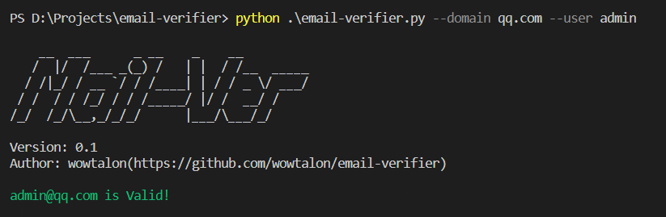

<pre>
    __  ___      _ __    _    __
   /  |/  /___ _(_) /   | |  / /__  _____
  / /|_/ / __ `/ / /____| | / / _ \/ ___/
 / /  / / /_/ / / /_____/ |/ /  __/ /
/_/  /_/\__,_/_/_/      |___/\___/_/
</pre>

一条命令检查邮箱地址是否有效。

```bash
python email-verifier.py --domain qq.com --user admin
```

